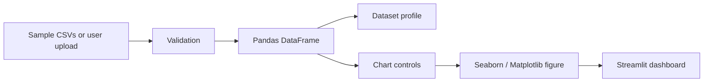

# Data Visualizer


Data Visualizer is a lightweight Streamlit app for quick CSV profiling and exploratory visualization. It supports built-in sample datasets and user-uploaded CSV files, then generates column profiles, descriptive statistics, and common charts.

## Features

- Built-in sample CSV selection from the `data/` folder
- CSV upload with file-size validation
- Dataset preview, shape metrics, missing-value profile, and descriptive statistics
- Scatter, line, bar, distribution, count, and box plots
- Type-aware validation for numeric chart requirements
- Cached default dataset loading for faster repeat exploration

## Architecture



## Project Structure

```text
data-visualizer/
|-- main.py
|-- requirements.txt
|-- README.md
|-- .gitignore
`-- data/
    |-- diabetes.csv
    |-- heart.csv
    |-- parkinsons.csv
    |-- tips.csv
    `-- titanic.csv
```

## Quick Start

```bash
python -m venv .venv
.venv\\Scripts\\activate
pip install -r requirements.txt
streamlit run main.py
```

On macOS/Linux, activate with:

```bash
source .venv/bin/activate
```

## Usage

1. Choose a built-in sample dataset or upload a CSV.
2. Review the data profile and missing-value summary.
3. Select chart type and axes.
4. Generate a chart and iterate on the exploration.

## Configuration

The app currently limits uploaded CSV files to 25 MB through `MAX_UPLOAD_SIZE_MB` in `main.py`.

## Quality Notes

- The app validates empty files and incompatible chart selections.
- Default datasets are cached with `st.cache_data`.
- Matplotlib figures are closed after rendering to reduce memory growth during repeated chart generation.

## Roadmap

- Add downloadable profiling reports
- Add correlation heatmaps
- Add automatic chart recommendations
- Add tests for CSV validation and chart configuration

## Troubleshooting

| Issue | Fix |
|---|---|
| Upload fails | Confirm the file is a valid CSV and below 25 MB. |
| Chart fails | Use numeric columns for distribution, scatter, line, bar, and box plots where required. |
| No default data appears | Confirm CSV files exist inside the `data/` directory. |

## License

No license file is currently included. Add a license before reusing or distributing this project.
